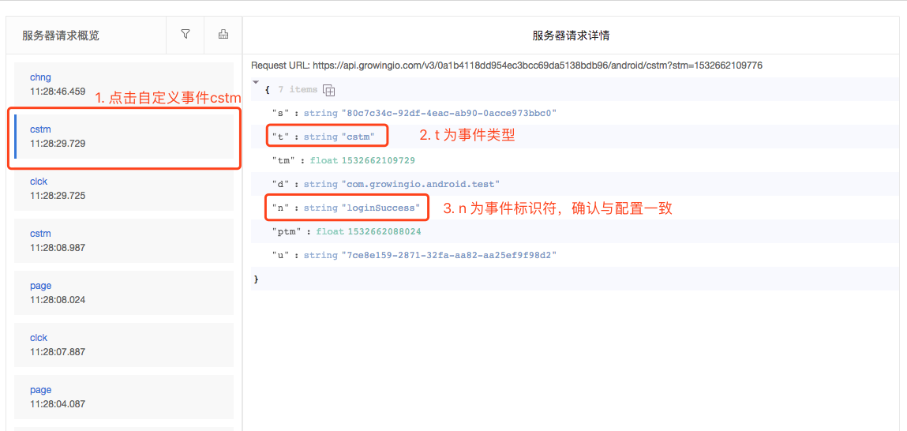
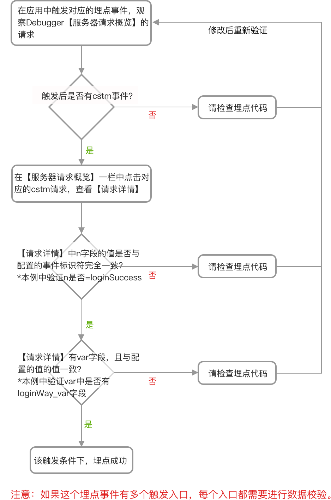
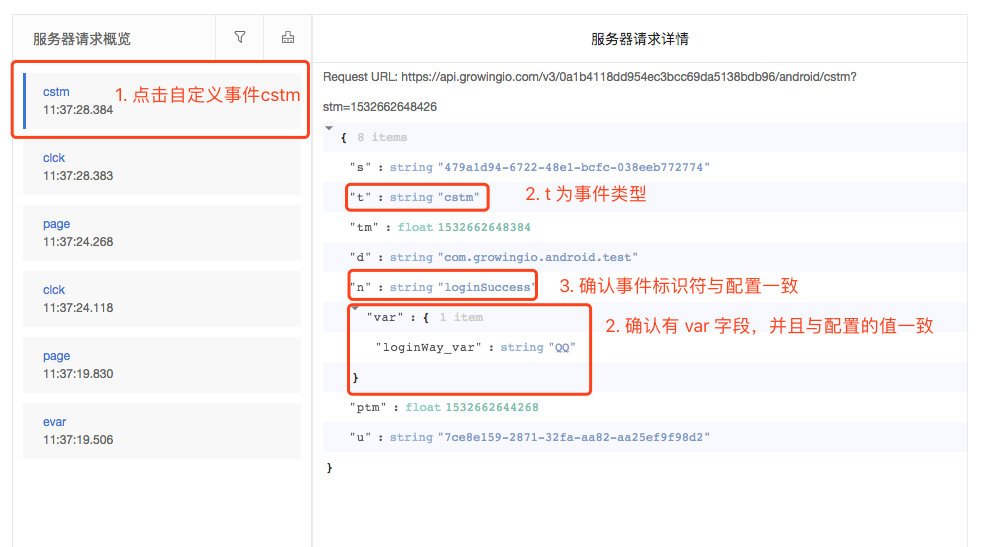

# cstm（事件以及关联的事件级变量）事件

### 场景一：计数器类型的埋点事件（无关联事件级变量）

> 以”登录成功“这个事件为例，打点记录登录成功的次数。

**事件配置方式示例**

| 标识符 | 名称 | 事件级变量 | 类型 | 描述 |
| :--- | :--- | :--- | :--- | :--- |
| loginSuccess | 登录成功 | 无 | 计数器 | 登录成功次数 |

**对应的代码**

| 平台 | 方法原型 | 代码示例 |
| :--- | :--- | :--- |
| JS SDK | gio\('track', eventId\) ; | gio\('track', 'loginSuccess'\); |
| Android SDK | GrowingIO.getInstance\(\).track\(`String` eventId\); | GrowingIO.getInstance\(\).track\("loginSuccess"\); |
| iOS SDK | +\(void\)track:\(NSString \*\)eventId; | \[Growing track: @"loginSuccess"\]; |

**数据验证方法**

在对应的应用（网站、Android或者iOS App）中触发登录成功事件，通过Debugger工具验证数据准确性。

按照如下流程图进行验证：

在本例中，如下图的数据请求说明打点代码生效

### 场景二：计数器类型的埋点事件（有关联事件级变量）

> 以”登录成功“这个事件为例，打点记录登录成功的次数，同时需要区分不同登录方式对应的登录成功次数。
>
> 那么”登录方式“就作为”登录成功“这个事件的属性，也就是事件级变量。

**事件配置方式示例**

| 标识符 | 名称 | 事件级变量 | 类型 | 描述 |
| :--- | :--- | :--- | :--- | :--- |
| loginSuccess | 登录成功 | 登录方式 | 计数器 | 登陆成功次数 |

**事件级变量配置方式示例**

| 标识符 | 名称 | 类型 | 描述 |
| :--- | :--- | :--- | :--- |
| loginWay\_var | 登录方式 | 字符串 | 登录方式，取值包括QQ、微信、手机等 |

**对应的代码**

此示例中的自定义事件为”登录成功（loginSuccess）“，关联一个事件级变量为”登录方式（loginWay\_var）“。

<table>
  <thead>
    <tr>
      <th style="text-align:left">&#x5E73;&#x53F0;</th>
      <th style="text-align:left">&#x539F;&#x578B;</th>
      <th style="text-align:left">&#x4EE3;&#x7801;&#x793A;&#x4F8B;</th>
    </tr>
  </thead>
  <tbody>
    <tr>
      <td style="text-align:left">JS SDK</td>
      <td style="text-align:left">gio(&apos;track&apos;, eventId, eventLevelVariables);</td>
      <td style="text-align:left">gio(&apos;track&apos;, &apos;loginSuccess&apos;, {loginWay_var&apos;:&apos;QQ&apos;})</td>
    </tr>
    <tr>
      <td style="text-align:left">Android SDK</td>
      <td style="text-align:left">GrowingIO.getInstance().track(<code>String</code> eventId, <code>JSONObject</code> eventLevelVariables);</td>
      <td
      style="text-align:left">GrowingIO.getInstance().track(&quot;loginSuccess&quot;, new JSONObject().put(&quot;loginWay_var&quot;,&quot;QQ&quot;));</td>
    </tr>
    <tr>
      <td style="text-align:left">iOS SDK</td>
      <td style="text-align:left">
        
+(void)track:(NSString *)eventId withVariable:

        
(NSDictionary *)variable;

      </td>
      <td style="text-align:left">[Growing track:@&quot;loginSuccess&quot; withVariable: @{@&quot;loginWay_var&quot;:@&quot;QQ&quot;}];</td>
    </tr>
  </tbody>
</table>

**数据验证方法**

在对应的应用（网站、Android 或者 iOS App）中触发登录成功事件，通过 Debugger 工具验证数据准确性。

按照如下流程图进行验证：

在本例中，如下图的数据请求说明打点代码生效

