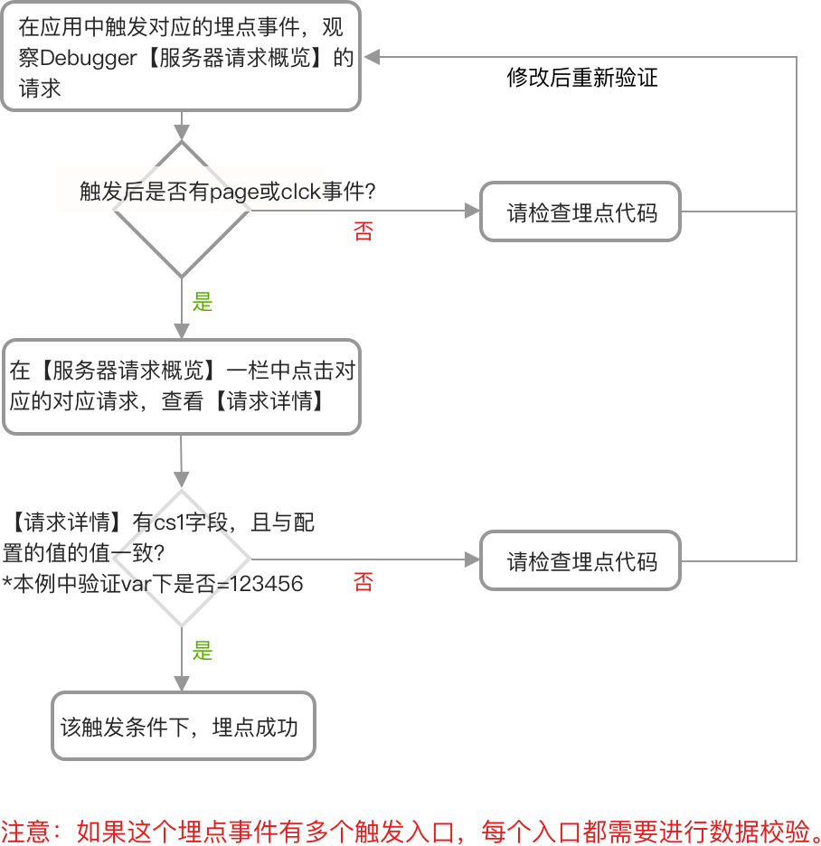
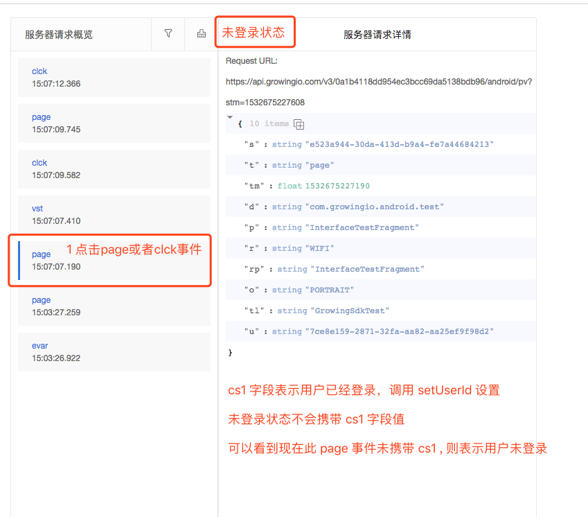
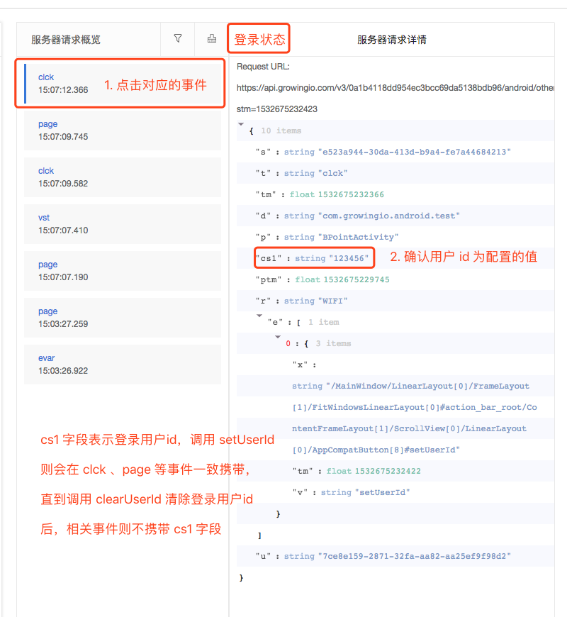
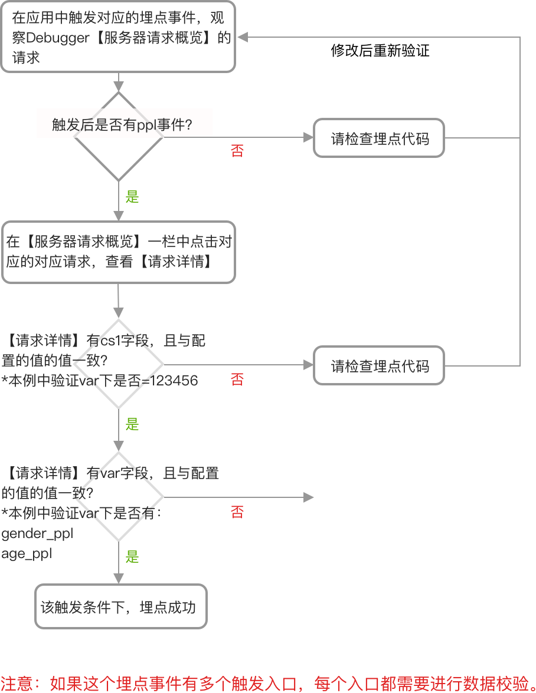
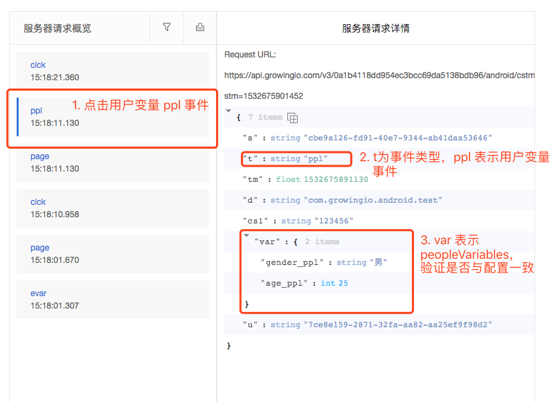

# ppl（用户变量）事件

### 场景一：用户变量之登录用户ID

验证上传的登录用户ID数据（因登录用户ID是主键，因此若未上传登录用户ID，其他任何上传的用户变量都是无效的。）

#### **登录用户ID配置方式** 

登录GrowingIO平台，在主菜单中选择**数据中心**&gt;**数据管理**&gt;**变量**&gt;**用户变量**，在用户变量下的**登录用户变量**页签下，打开登录用户ID的启动状态，即完成配置。

**对应的代码**

此示例中的用户变量为登录用户ID，在用户登录时设置

<table>
  <thead>
    <tr>
      <th style="text-align:left">&#x5E73;&#x53F0;</th>
      <th style="text-align:left">&#x539F;&#x578B;</th>
      <th style="text-align:left">&#x4EE3;&#x7801;&#x793A;&#x4F8B;</th>
    </tr>
  </thead>
  <tbody>
    <tr>
      <td style="text-align:left">JS SDK</td>
      <td style="text-align:left">
        
// &#x7528;&#x6237;&#x767B;&#x5F55;&#x65F6;&#xFF0C;&#x8BBE;&#x7F6E;&#x767B;&#x5F55;&#x7528;&#x6237;ID

        
gio(&apos;setUserId&apos;, userId);

        
// &#x7528;&#x6237;&#x9000;&#x51FA;&#x767B;&#x5F55;&#x65F6;&#xFF0C;&#x6E05;&#x9664;&#x767B;&#x5F55;&#x7528;&#x6237;ID

        
gio(&apos;clearUserId&apos;);

      </td>
      <td style="text-align:left">
        
// &#x7528;&#x6237;&#x767B;&#x5F55;&#x65F6;&#xFF0C;&#x8BBE;&#x7F6E;&#x767B;&#x5F55;&#x7528;&#x6237;ID

        
gio(&apos;setUserId&apos;, &apos;123456&apos;);

        
// &#x7528;&#x6237;&#x9000;&#x51FA;&#x767B;&#x5F55;&#x65F6;&#xFF0C;&#x6E05;&#x9664;&#x767B;&#x5F55;&#x7528;&#x6237;ID

        
gio(&apos;clearUserId&apos;);

      </td>
    </tr>
    <tr>
      <td style="text-align:left">Android SDK</td>
      <td style="text-align:left">
        
//&#x7528;&#x6237;&#x767B;&#x5F55;&#x65F6;&#xFF0C;&#x8BBE;&#x7F6E;&#x767B;&#x5F55;&#x7528;&#x6237;ID

        
GrowingIO.getInstance().setUserId(String userId);

        
//&#x7528;&#x6237;&#x9000;&#x51FA;&#x767B;&#x5F55;&#x65F6;&#xFF0C;&#x6E05;&#x9664;&#x767B;&#x5F55;&#x7528;&#x6237;ID

        
GrowingIO.getInstance().clearUserId();

      </td>
      <td style="text-align:left">
        
//&#x7528;&#x6237;&#x767B;&#x5F55;&#x65F6;&#xFF0C;&#x8BBE;&#x7F6E;&#x767B;&#x5F55;&#x7528;&#x6237;ID

        
GrowingIO.getInstance().setUserId(&quot;123456&quot;);

        
//&#x7528;&#x6237;&#x9000;&#x51FA;&#x767B;&#x5F55;&#x65F6;&#xFF0C;&#x6E05;&#x9664;&#x767B;&#x5F55;&#x7528;&#x6237;ID

        
GrowingIO.getInstance().clearUserId();

      </td>
    </tr>
    <tr>
      <td style="text-align:left">iOS SDK</td>
      <td style="text-align:left">
        
//&#x7528;&#x6237;&#x767B;&#x5F55;&#x65F6;&#xFF0C;&#x8BBE;&#x7F6E;&#x767B;&#x5F55;&#x7528;&#x6237;ID

        
+ (void)setUserId:(NSString *)userId;

        
//&#x7528;&#x6237;&#x9000;&#x51FA;&#x767B;&#x5F55;&#x65F6;&#xFF0C;&#x6E05;&#x9664;&#x767B;&#x5F55;&#x7528;&#x6237;ID

        
+ (void)clearUserId;

      </td>
      <td style="text-align:left">
        
//&#x7528;&#x6237;&#x767B;&#x5F55;&#x65F6;&#xFF0C;&#x8BBE;&#x7F6E;&#x767B;&#x5F55;&#x7528;&#x6237;ID

        
[Growing setUserId:@&quot;123456&quot;];

        
//&#x7528;&#x6237;&#x9000;&#x51FA;&#x767B;&#x5F55;&#x65F6;&#xFF0C;&#x6E05;&#x9664;&#x767B;&#x5F55;&#x7528;&#x6237;ID

        
[Growing clearUserId];

      </td>
    </tr>
  </tbody>
</table>

**数据验证方法**

在对应的应用（网站、Android 或者 iOS App）中的进行登录、退出登录、切换账号登录的操作，通过 Debugger 工具验证数据准确性

按照如下流程图验证

在本例中，如下图的数据请求说明打点代码生效

* 未登录

* 已登录

### 场景二：其他用户变量

验证上传的除登录用户ID之外的其他用户变量数据（因登录用户ID是主键，因此若未上传登录用户ID，其他任何上传的用户变量都是无效的，所以请确保已经上传登录用户ID）

本例中除登录用户ID之外，还上传了用户性别、用户年龄这两个用户变量

**其他用户变量配置方式示例**

| 标识符 | 名称 | 描述 | 归因 |
| :--- | :--- | :--- | :--- |
| gender\_ppl | 用户性别 | 用户性别 | 根据需求选择（不涉及数据验证） |
| age\_ppl | 用户年龄 | 用户年龄 | 根据需求选择（不涉及数据验证） |

**对应的代码**

此示例中的用户变量为“用户性别（gender\_ppl）”、“用户年龄（age\_ppl）”，在用户登录或者变量值发生变化时进行设置

<table>
  <thead>
    <tr>
      <th style="text-align:left">&#x5E73;&#x53F0;</th>
      <th style="text-align:left">&#x539F;&#x578B;</th>
      <th style="text-align:left">&#x4EE3;&#x7801;&#x793A;&#x4F8B;</th>
    </tr>
  </thead>
  <tbody>
    <tr>
      <td style="text-align:left">JS SDK</td>
      <td style="text-align:left">gio(&apos;people.set&apos;, key, value);&#x6216;gio(&apos;people.set&apos;,
        customerVariables);</td>
      <td style="text-align:left">gio(&apos;people.set&apos;, {&apos;gender_ppl&apos;: &apos;&#x7537;&apos;,
        &apos;age_ppl&apos;: 25});</td>
    </tr>
    <tr>
      <td style="text-align:left">Android SDK</td>
      <td style="text-align:left">
        
GrowingIO.getInstance().setPeopleVariable(String key, String value);

        
&#x6216;

        
GrowingIO.getInstance().setPeopleVariable(JSONObject peopleVariables);

      </td>
      <td style="text-align:left">
        
JSONObject jsonObject = new JSONObject();

        
jsonObject.put(&quot;gender_ppl&quot;, &quot;&#x7537;&quot;);

        
jsonObject.put(&quot;age_ppl&quot;, 25);

        
GrowingIO.getInstance().setPeopleVariable(jsonObject);

      </td>
    </tr>
    <tr>
      <td style="text-align:left">iOS SDK</td>
      <td style="text-align:left">
        
+ (void)setPeopleVariableWithKey:(NSString *)key andStringValue:(NSString
          *)stringValue;

        
&#x6216;

        
+ (void)setPeopleVariable:(NSDictionary&lt;NSString *, NSObject *&gt;
          *)variable;

      </td>
      <td style="text-align:left">[Growing setPeopleVariable:@{@&quot;gender_ppl&quot;:@&quot;&#x7537;&quot;,
        @&quot;age_ppl&quot;:@25}];</td>
    </tr>
  </tbody>
</table>

**数据验证方法**

在对应的应用（网站、Android 或者 iOS App）中触发对应的用户变量，通过 Debugger 工具验证数据准确性

按照如下流程图验证

在本例中，如下图的数据请求说明打点代码生效

